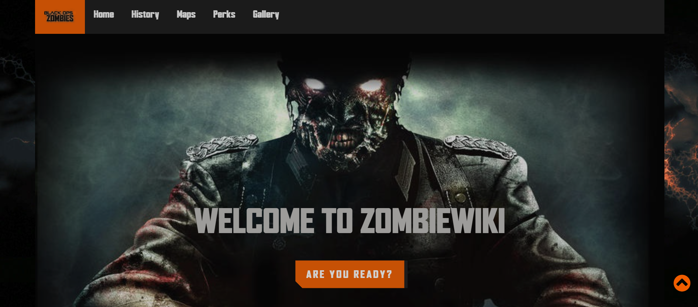
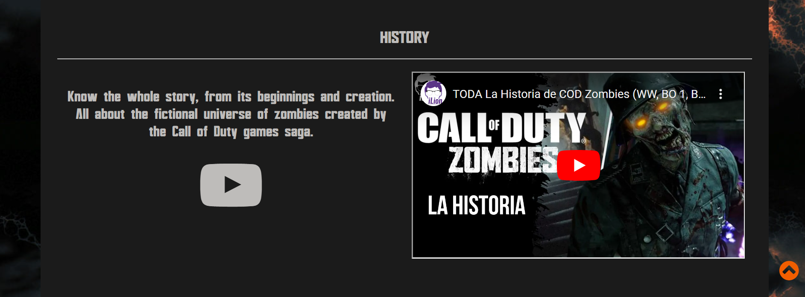
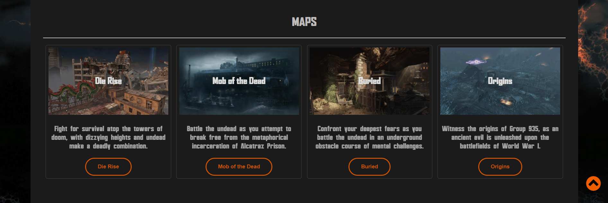
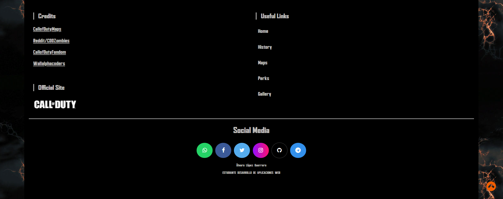

<h1>Memoria del proyecto fin de evaluación de Lenguajes de Marcas - 1º DAW</h1>
<h2>ZombiesWiki</h2>
<h2>Table of Contents</h2>
<ul>
  <li><a href="#introduccion">Introduction</a></li>
  <li><a href="#motivacion">Motivation</a></li>
  <li><a href="#estructura">Structure</a></li>
  <li><a href="#estilo">Style</a></li>
</ul>

<h2 id="introduccion">Introduction</h2>

Work done by: Álvaro López Guerrero

Website proyect "from scratch" of 1st evaluation of "Lenguajes de Marcas"

December 2023 

License  CC-BY

<h2 id="motivacion">Motivation</h2>

I have selected this topic because I am a big fan of this game mode of the video game black ops II belonging to the Call of Duty saga.

<h2 id="estructura">Structure</h2>

The website is divided into 6 sections:

<ul>
  <li>Hero Section</li>  
  <li>History</li>
  <li>Maps</li>
  <li>Perks</li>
  <li>Gallery</li>
  <li>Footer</li>
</ul>

<h3>Hero Section</h3>

The section is composed by a background image, being responsive. 
On it I have placed the title of the page and a Call of Action button styled using code snippets from uiverse.io and the title of the web page.

<h3>History</h3>

I have arranged in a grid of 2 columns, a brief introduction to the section, and accompanying this in the other column, I have placed a video about the history of the topic of the page, from youtube.

<h3>Maps</h3>

In this section I have implemented a grid with 4 columns, where the content is in cards 
Within the cards we can find an image of each map, a brief description of the map and a button with a link to more information from an external page. 
For the button I have used a styling from uiverse.io.

<h3>Perks</h3>

This section is composed of a 5-column grid, where the content is in reversible cards. 
The cards are styled as follows a w3schools tutorial.

<h3>Gallery</h3>

This section is composed by a slideshow gallery of pictures  

<h3>Footer</h3>

The footer is composed of a grid of 2 columns where we find the credits and the official page of the game 
In the other column the links to text of the page itself. 
And finally below this I have placed the social networks of Call of Duty and mine.

<h2 id="estilo">Site style</h2>
<h3>Color Palette</h3>
<ul>
  <li>#1B1B1B</li>  
  <li>#2D1918</li>
  <li>#BEBCBA</li>
  <li>#F15E00</li>
  <li>#444</li>
</ul>

<h3>Fonts</h3>

For the titles: AgencyFB Black Regular.

For the body text: Bayformance.

<h3>Images</h3>

.....

<h3>Videos</h3>

"https://www.youtube.com/embed/pIPLIYQUfwQ?si=ONvKJGPRza6PbnOe"

<h2 id="snippets">Code snippets</h2>

I have used the following:

<ul>
  <li>Navigation bar: from w3Schools "How to" "Responsive Topnav" https://www.w3schools.com/howto/howto_js_topnav_responsive.asp</li>
  <li>Buttons: from uiverse.io. https://uiverse.io/all?search=button</li>
  <li>Flip Cards: from w3Schools "How to" "Flip Cards" [https://uiverse.io/all?search=button](https://www.w3schools.com/howto/howto_css_flip_card.asp)</li>
  <li>Gallery: from w3Schools "How to" "SlideShow Gallery" https://www.w3schools.com/howto/howto_js_slideshow_gallery.asp</li>
</ul>
